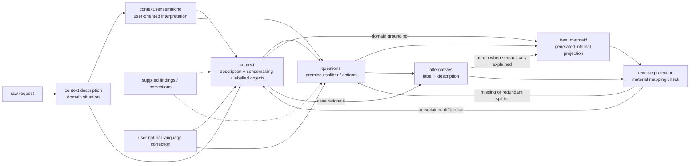

# Decision Formation Property Model

This document defines the working object for decision structuring. It applies
to supplied case material and its structured views. The caller owns external
research, user interviews, appraisal methods, and persistence formats.

## Design goals

- Keep the meaning that an AI can explain in long natural-language strings.
- Keep the pieces that drive comparison small enough to inspect and revise.
- Derive diagrams and alternatives from semantic state instead of maintaining
  several independently editable representations.
- Allow the case to add information without forcing a fixed ontology for every
  domain or evidence source.

## Working object

The conceptual working object has these top-level properties:

```yaml
context:
  description: "Domain context in which the decision or request sits."
  sensemaking: "A user-oriented account of what the request means, why it matters, and where its framing may be incomplete."
  objects:
    - label: "deployment constraint"
      detail: "The first release must run in the existing region."
questions:
  - premise: "The organization must introduce the capability without losing operational control."
    splitter: "Can the capability be introduced in stages while control is retained?"
    actions:
      - "Introduce it in one controlled stage"
      - "Introduce it incrementally by workflow"
alternatives:
  - label: "Staged internal rollout"
    description: "Start with a controlled workflow and expand after operational evidence is available."
  - label: "Incremental workflow rollout"
    description: "Introduce the capability one workflow at a time and use each result to guide the next."
tree_mermaid: |
  flowchart TD
    root["Control must be retained"] --> q1{"Staged introduction?"}
    q1 -->|"one controlled stage"| a1["Staged internal rollout"]
    q1 -->|"incremental by workflow"| a2["Incremental workflow rollout"]
```

## Whole-system model

The property relationships and feedback routes are:



The arrows describe semantic dependencies, not a requirement to expose every
stage in every answer. `tree_mermaid` and `alternatives` are regenerated after a
material Context or Question update. Supplied observations, user statements,
interpretations, and reference-model prompts retain their distinct epistemic
roles. A reference-model prompt is not evidence about the case.

The object is conceptual; the caller decides how to store or present it. A case may
start with only `context` and an empty `questions` or
`alternatives` list. Properties may be absent from a provisional internal
snapshot when they are not yet needed, but a delivered formation view should
make unresolved materiality explicit rather than silently filling gaps.

### `context`

Write `context.description` first, then `context.sensemaking`; present the
Context properties in the order `description`, `sensemaking`, `objects`.
This is the provisional drafting order as well as the example's field order,
not a claim about the model's internal reasoning order.

`context.description` is a free-form string for the domain situation grounded
in the supplied material. Keep explicit facts, negations, and unknowns intact.

`context.sensemaking` is a free-form string written for the user. It explains the
literal request, purpose, premise repairs, framing tensions, latent decision or
agency, and the practical meaning of the case. It is intentionally not a
controlled list or a short status code. It is an interpretive input to
formation, not external-world evidence and not a substitute for user values.

Keep interpretation distinct from the domain description even though both
belong to Context. Mark inferred background and purposes as hypotheses. After
drafting sensemaking, check both fields against the original material; preserve
the distinction between facts, negations, unknowns, and hypotheses when revising.

Every member of `context.objects` is a mapping with only a unique local string
`label` as its required property:

```yaml
label: "a unique local name"
```

The `label` must be a non-empty string unique within this Formation. All other
properties are optional and unconstrained by this skill. They may carry a fact,
constraint, appraisal finding, research result, reference-model prompt, interview response,
or any domain-specific payload that the current case needs. Do not introduce a
fixed `source`, `role`, `type`, or nested facts/constraints schema merely to
make objects look uniform. When provenance matters, explain it in the object's
free-form payload or in the surrounding narrative while preserving the
epistemic boundaries in [the workflow](workflow.md).

`objects` is therefore an extensible case surface, not a hidden canonical
ontology. An empty array is valid.

### `questions`

Each Question mapping has exactly these three properties and no additional
formation fields:

```yaml
premise: "The situation in which this Question matters."
splitter: "The distinction that divides that premise into materially different paths."
actions: ["A candidate design or decision move", "Another candidate move"]
```

- `premise` and `splitter` are strings and may be long enough to preserve the
  reasoning needed to interpret them.
- `actions` is an array of strings. Each item is a candidate design or
  decision move, not a workflow step or an instruction to the user.
- `actions: []` is valid and means that the Question is currently unresolved.
  Never invent actions to make an unresolved Question appear complete. If the
  Question is material, report the missing information or clarification to the
  caller; otherwise carry it as an explicit uncertainty.
- Do not add Question IDs, level fields, resolution states, challenge modes,
  routing flags, or action objects in this release.
- One Question describes one material splitter. If there are independent
  splitters, create separate Questions rather than hiding several axes in one
  object.

Questions, together with `context`, are the authoritative formation semantics.
Before projecting, promote any material fact, constraint, or distinction found
in `context.sensemaking` into `context.description`, a labelled
`context.objects` entry, or a Question, retaining its evidential status;
explanatory prose alone must not
silently drive an alternative. Question count is not a quality score; keep only
distinctions that can change a strong alternative, its design principle, its
viability, or comparability.

### `alternatives`

Each alternative mapping has exactly these two properties and no additional
formation fields:

```yaml
label: "Staged internal rollout"
description: "A coherent design principle and enough implementation meaning to compare it."
```

The `label` is a unique local display name within the current Formation. It is
not a stable machine ID and must not be used as an implicit cross-record
reference. The `description` is a free-form explanation at the same level of
abstraction as peer alternatives.

During exploration, zero or one provisional alternative is valid. Before a
comparison is attempted, there must be at least two coherent,
comparable alternatives. Two labels alone are insufficient: if the alternatives
are duplicates, caricatures, or abstraction mismatches, return to Questions or
Context and re-form them. Do not add a status quo, compromise, or maximal option
unless it is independently rational for the case.

Alternatives do not contain Question or action references. Their connection to
the option space is reconstructed semantically from descriptions, Question
premises, splitters, and actions.

### `tree_mermaid`

`tree_mermaid` is a string containing a Mermaid diagram generated from
`context`, `questions`, and the current alternatives. It is the internal Tree
representation for this release. Mermaid aliases are ephemeral render aliases;
they are not Question IDs, alternative IDs, or persistence keys.

Question actions form the Tree skeleton. For `actions: []`, render the Question
as an unresolved node with no invented outgoing branch. Attach an alternative at the action
leaf or in an annotation when its design logic can be explained by that path.
If a material alternative or action cannot be mapped, annotate it as an
**unexplained alternative/action** and return to Context or Questions. Never
invent a semantic connection just to make the diagram look complete.

Generate and retain an internal `tree_mermaid` for every structuring pass.
The caller decides when to invoke the skill and expose the Tree. Keep a sketch
minimal for a narrow request; do not invent a decision just to populate it.

## Correction and regeneration contract

The user corrects the formation in ordinary language. Interpret a report such
as “that split is wrong,” “this branch is missing,” or “these two options are
the same” as a request to revise `context` and/or `questions` (and the
provisional narrative when needed), then regenerate `tree_mermaid` and `alternatives`.
The user does not edit Mermaid nodes directly, and Mermaid
aliases must not become a second source of truth. If the correction is
materially ambiguous, report the targeted clarification needed to the caller
rather than guessing a branch.

External appraisal feedback follows the same contract: switching conditions and option
definition defects revise Questions; facts, constraints, evidence gaps, and
feasibility findings revise Context. A finding can update both when it genuinely
contains both kinds of meaning. Re-project and report whether the comparison materially changed. The caller
decides whether to rerun an external appraisal.
